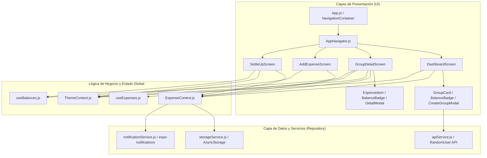

# 📖 Arquitectura, Pantallas y Flujos de Datos — SplitPay
### *Documentación Técnica y Funcional del Código Fuente*

---

## 🏛️ 1. Arquitectura del Sistema (Clean Architecture / Por Capas)

SplitPay está construido siguiendo una arquitectura desacoplada basada en componentes, contextos y el patrón repositorio:



---

## 📱 2. Detalle Exhaustivo de Pantallas e Interacción con el Código

---

### 2.1 Dashboard de Inicio (`src/screens/DashboardScreen.js`)

#### 📌 Propósito Funcional:
Es el punto de entrada de la app. Muestra el estado financiero global del usuario y la lista de todos sus grupos activos.

#### 🔍 Elementos Visuales y Funcionalidades:
1. **Tarjeta Superior de Balance Total**:
   - **Verde**: Si el balance total del usuario es positivo (`overallUserBalance > 0`), indicando *"💰 Balance Total (Te deben)"*.
   - **Rojo**: Si el balance total es negativo (`overallUserBalance < 0`), indicando *"💸 Balance Total (Debes)"*.
   - **Gris/Neutro**: Si las cuentas están al día (`overallUserBalance === 0`).
2. **Botón de Modo Claro / Modo Oscuro (`☀️/🌙`)**:
   - Ejecuta `toggleTheme()` de `ThemeContext.js`, alternando la paleta de colores y guardando la preferencia en `storageService.js`.
3. **Botón de Restablecer Datos de Demostración (`🔄`)**:
   - Invoca `resetData()` para recargar los grupos y gastos semilla (*Depa Universitario*, *Viaje de Fin de Ciclo*, *Pichanga de los Viernes*).
4. **Lista de Grupos con `FlatList`**:
   - Renderiza un [`GroupCard.js`](file:///c:/Users/User/Desktop/SplitPay/src/components/GroupCard.js) por cada grupo.
   - Cada tarjeta muestra: Ícono del grupo, nombre, número de miembros, stack de avatares superpuestos y el **balance individual del usuario en ese grupo específico**.
5. **Botón Flotante (FAB `＋`)**:
   - Abre [`CreateGroupModal.js`](file:///c:/Users/User/Desktop/SplitPay/src/components/CreateGroupModal.js) para crear un nuevo grupo.

#### ⚙️ Interacción en el Código:
* Consume `useExpenseContext()` para obtener: `groups`, `expenses`, `currentUser`, `overallUserBalance`, `isLoading`, `createGroup` y `resetData`.
* Al pulsar sobre una tarjeta de grupo: `navigation.navigate('GroupDetail', { groupId: item.id })`.
* Al crear un grupo en el modal: Llama a `apiService.getRandomAvatar()` para asignar fotos a los integrantes y guarda el nuevo grupo en `AsyncStorage`.

---

### 2.2 Detalle del Grupo (`src/screens/GroupDetailScreen.js`)

#### 📌 Propósito Funcional:
Permite gestionar la actividad dentro de un grupo seleccionado, navegar entre el historial de gastos y el resumen de balances de los integrantes.

#### 🔍 Elementos Visuales y Funcionalidades:
1. **Cabecera del Grupo**:
   - Muestra el ícono grande, título, descripción, monto total gastado en el grupo y tu saldo particular.
   - Botón de basurero (`🗑️`) para eliminar el grupo completo con confirmación de seguridad.
2. **Navegación por Pestañas Internas (Tab Switch)**:
   - **Pestaña "🧾 Gastos"**:
     - Historial cronológico con `FlatList` de los gastos del grupo.
     - Selector de filtros por categoría: *Todos*, *Comida 🍕*, *Transporte 🚕*, *Casa 🏠*, *Ocio 🍻*.
     - Al tocar cualquier gasto, abre el **Modal de Detalle Completo** (mostrando pagador, fecha, desglose de participantes, boleta adjunta y botón para eliminar).
   - **Pestaña "⚖️ Balances"**:
     - Lista de todos los integrantes del grupo.
     - Muestra cuánto dinero desembolsó cada persona (`Pagó`), cuánto consumió (`Le toca`) y su `BalanceBadge` (verde si le deben, rojo si debe).
3. **Barra Inferior de Acciones**:
   - Botón **"🤝 Liquidar"**: Navega a `SettleUpScreen`.
   - Botón **"＋ Registrar Gasto"**: Navega a `AddExpenseScreen`.

#### ⚙️ Interacción en el Código:
* Recibe el parámetro `{ groupId }` desde la navegación.
* Invoca `useExpenses(groupId)`: Hook que filtra los gastos del grupo, los ordena por fecha (`new Date(b.date) - new Date(a.date)`) y aplica los filtros de categoría.
* Invoca `useBalances(group, expenses, currentUser.id)`: Hook que calcula los saldos y las deudas individuales en tiempo real.

---

### 2.3 Registrar Nuevo Gasto (`src/screens/AddExpenseScreen.js`)

#### 📌 Propósito Funcional:
Formulario interactivo para ingresar un gasto y dividirlo equitativamente entre los miembros seleccionados.

#### 🔍 Elementos Visuales y Funcionalidades:
1. **Banner Superior**: Indica claramente en qué grupo se está registrando el gasto.
2. **Entrada de Monto Principal**: `TextInput` estilizado con prefijo `S/.` y teclado numérico/decimal.
3. **Concepto del Gasto**: Campo de texto (ej. *"Pizza de Estudio"*).
4. **Selector de Categorías**: Cuadrícula interactiva con iconos y colores temáticos (Comida, Transporte, Casa, Ocio).
5. **Selector de Pagador**: Chips horizontales para elegir quién desembolsó el dinero.
6. **División Multi-Select con Cuota en Vivo**:
   - Permite marcar o desmarcar quiénes participan del gasto.
   - **Cálculo en tiempo real**: Muestra un aviso dinámico:  
     $$\text{Cada participante asume: } \frac{\text{Monto Total}}{\text{N° Participantes Seleccionados}}$$
7. **Hardware y Sensores (Unidad 3)**:
   - **📸 Adjuntar Recibo**: En Web abre el Explorador de Archivos de Windows; en celular abre la Cámara o la Galería (`expo-image-picker`).
   - **📍 Capturar GPS**: Obtiene las coordenadas y dirección del lugar con `expo-location`.
8. **Botón Guardar Gasto**:
   - Valida que el monto sea $> 0$, el concepto no esté vacío y haya al menos un participante.

#### ⚙️ Interacción en el Código:
* Al presionar "Guardar": Ejecuta `addExpense()` en `ExpenseContext.js`.
* `ExpenseContext` crea el objeto `Expense`, lo persiste en `AsyncStorage` mediante `storageService.js` y dispara una notificación local (`notificationService.notifyExpenseAdded()`).
* Finalmente ejecuta `navigation.goBack()`, actualizando automáticamente la lista de gastos y balances.

---

### 2.4 Liquidación de Deudas (`src/screens/SettleUpScreen.js`)

#### 📌 Propósito Funcional:
Resuelve matemáticamente las cuentas del grupo sugiriendo el menor número de pagos necesarios y permitiendo registrar las cancelaciones.

#### 🔍 Elementos Visuales y Funcionalidades:
1. **Cálculo de Transferencias Mínimas Óptimas**:
   - Cada tarjeta muestra el flujo directo:  
     $$\text{[Deudor (Rojo)]} \xrightarrow{\text{S/. XX.XX}} \text{[Acreedor (Verde)]}$$
   - Si no hay deudas pendientes, muestra una pantalla de felicitación: *"¡Todas las cuentas están al día! 🎉"*.
2. **Botón "✓ Registrar Pago / Saldar Cuentas"**:
   - Abre un modal de confirmación con el monto y los nombres involucrados.
3. **Selector de Métodos de Pago**:
   - **Yape 💜**
   - **Plin 💙**
   - **Efectivo 💵**
4. **Al Confirmar**:
   - Registra el pago en la base de datos local y recalcula los balances para que las deudas desaparezcan de la lista.

#### ⚙️ Interacción en el Código:
* Consume `useBalances.js`, el cual ejecuta el **Algoritmo Greedy de Liquidación**:
  ```javascript
  // 1. Separa en deudores y acreedores ordenados por monto:
  debtors.sort((a, b) => b.amount - a.amount);
  creditors.sort((a, b) => b.amount - a.amount);

  // 2. Empareja deudor con acreedor saldando el mínimo entre ambos:
  const settleAmount = Math.min(debtor.amount, creditor.amount);
  ```
* Al saldar: Invoca `settleDebt()` en `ExpenseContext.js`, el cual crea un registro de tipo `isSettlement: true` en `AsyncStorage`, equilibrando las cuentas.

---

## 🔄 3. Resumen de Flujo de Datos

```text
[ Usuario realiza una acción ] 
         │
         ▼
[ Custom Hook / Componente UI ] (ej. useExpenses / useBalances)
         │
         ▼
[ ExpenseContext / ThemeContext ] (Estado Reactivo Global)
         │
         ▼
[ storageService.js ] (Persistencia Local con AsyncStorage)
         │
         ▼
[ Re-renderizado Reactivo Instantáneo en todas las pantallas ]
```

---

## 🔮 4. Precedente para Futuras Fases (Escalabilidad)

Quedan registrados los siguientes precedentes para las siguientes entregas del curso:
1. **Pasarela de Pago PayPal**: Posibilidad de añadir PayPal Sandbox como cuarto método de liquidación internacional junto a Yape, Plin y Efectivo.
2. **Foto de Comprobante en Efectivo**: Opción para adjuntar foto de constancia física / recibo firmado al saldar deudas en efectivo.
3. **Sincronización en la Nube**: Posibilidad de conectar **Firebase Firestore** o un backend en **Node.js** reemplazando únicamente las llamadas internas de `storageService.js` sin tocar la interfaz de usuario.
